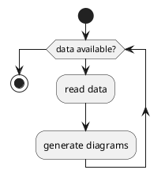

# Test Slides

### pandoc {.allowframebreaks} 

- UTF-8 required
- you can embed latex
- you can write markdown
- export is pdf
- check out the viewer


### embed latex

a: \textit{The cake was \emph{huge} for a cup cake}

b: `\textit{The cake was \emph{huge} for a cup cake}`{=latex}

c: `\textit{The cake was \emph{huge} for a cup cake}`{=tex}

### latex table

\begin{tabular}{|l|l|}\hline
Age & Frequency \\ \hline
18--25 & 15 \\
26--35 & 33 \\
36--45 & 22 \\ \hline
\end{tabular}

### 2 columns 

:::::::::::::: {.columns}
::: {.column width="40%"}
contents...
:::
::: {.column width="60%"}
contents...
:::
::::::::::::::

---------------------------

### Slide with a pause

content before the pause

. . .

content after the pause, but ... will be rendered

### Code {.allowframebreaks}



### diagram

```{ .plantuml height=50% plantuml-filename=test.png }
Alice -> Bob: Authentication Request
Bob --> Alice: Authentication Response
```
